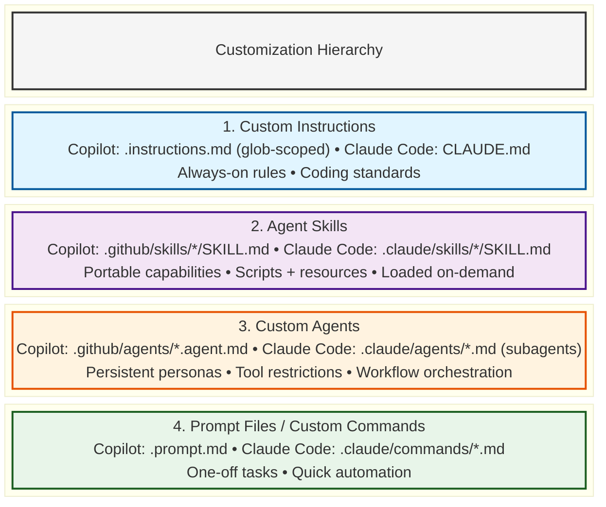

# Lab 06: Skills & Customization Hierarchy

**Module:** 1.5  
**Duration:** 25-30 minutes  
**Part:** Advanced (Part 2)  
**Tools**: GitHub Copilot or Claude Code (steps are shown side by side below)

## Objectives

By the end of this lab, you will:
- Understand the complete AI customization landscape (Skills, Agents, Instructions, Prompt Files) across GitHub Copilot and Claude Code
- Know when to use each customization type
- Explore a pre-built skill and understand its structure
- Use skills via slash/custom commands and automatic invocation
- Apply decision criteria to choose the right customization approach

## Prerequisites

- Completion of Part 1 labs (or equivalent Copilot/Claude Code experience)
- VS Code with GitHub Copilot enabled, **or** the Claude Code CLI installed and authenticated
- Access to the TaskManager workshop repository

## Background

### The AI Customization Landscape

Both GitHub Copilot and Claude Code offer **four main ways** to customize AI behavior. The concepts map closely between the two tools, though the exact file names and portability differ. Understanding when to use each is crucial for effective AI-assisted development.

#### The Four Customization Types



> NOTE: Consider moving prompt files and custom commands into skills for greater flexibility.

### Deep Dive: Agent Skills

**Agent Skills** are a shared, open-standard customization mechanism — the `SKILL.md` format is compatible between GitHub Copilot and Claude Code. They represent **portable, reusable capabilities** that work across multiple environments and tools.

#### What Makes Skills Special?

- **Portable**: Work in VS Code, GitHub Copilot CLI, GitHub Copilot coding agent, and Claude Code
- **Structured**: Directory-based with SKILL.md + optional scripts/resources
- **Progressive Loading**: Only loads content when relevant (efficient context usage)
- **Open Standard**: Based on the [agentskills.io](https://agentskills.io/) specification
- **Composable**: Can be combined with agents and other skills

#### Skill File Structure

|  GitHub Copilot |  Claude Code |
| ---------------------------------------------------------------------------------------- | --------------------------------------------------------------------------------- |
| `.github/skills/` (Copilot side not yet scaffolded — see `todo.md`)                      | `.claude/skills/` — see the real `test-data-generator` skill below                |

```text
.claude/skills/
└── test-data-generator/
    ├── SKILL.md                 # Required: Instructions with frontmatter
    ├── templates/               # Optional: Script/code resources
    │   └── TaskFactory.cs
    └── examples/                # Optional: Example files
        └── sample-tasks.json
```

#### SKILL.md Format

The frontmatter and body format is the same regardless of which tool loads it:

```markdown
---
name: test-data-generator
description: Generates realistic test data for integration tests
argument-hint: "[entity type] [count]"
user-invocable: true
disable-model-invocation: false
---

# Test Data Generator

This skill helps generate realistic test data for .NET integration tests...

## Usage

Invoke with: `/test-data-generator Task 10`

## Examples

...
```

This is the exact shape of the real
`.claude/skills/test-data-generator/SKILL.md` in this repository — open it
to see the full version, including its `templates/` and `examples/`
resources.

---

## Part 1: Understanding the Customization Hierarchy (10 minutes)

### Decision Framework

Use this decision tree to choose the right customization type (applies to both tools):

```text
┌─ Need to enforce coding standards across all files?
│  → Custom Instructions (.instructions.md in Copilot, CLAUDE.md in Claude Code)
│     Example: "Always use sealed classes", "Follow Clean Architecture"
│
┌─ Need a reusable capability with scripts or examples?
│  → Agent Skill (SKILL.md — same format in both tools)
│     Example: Test data generation, deployment checklist, debugging workflow
│
┌─ Need a persistent persona with tool restrictions?
│  → Custom Agent (.agent.md in Copilot, subagent .md in Claude Code)
│     Example: Architecture reviewer (read-only), Security auditor, Planner
│
└─ Need a quick one-off automated task?
   → Prompt File (.prompt.md in Copilot, custom command in Claude Code)
      Example: Generate PR description, Run pre-commit checks
```

### Comparison Table

| Feature                 | Instructions                                                             | Skills                                   | Agents              | Prompt Files / Commands |
| ----------------------- | ------------------------------------------------------------------------ | ---------------------------------------- | ------------------- | ----------------------- |
| **When Applied**        | Always                                                                   | On-demand                                | When selected       | On-demand               |
| **Portability**         | Copilot: VS Code only. Claude Code: `CLAUDE.md` applies repo-wide        | Multi-tool (Copilot + Claude Code + CLI) | VS Code/CLI + cloud | Tool-specific           |
| **Can Include Scripts** | ❌ No                                                                    | ✅ Yes                                   | ❌ No               | ❌ No                   |
| **Tool Restrictions**   | ❌ No                                                                    | ❌ No                                    | ✅ Yes              | ✅ Yes (optional)       |
| **Glob Patterns**       | ✅ Yes (Copilot `.instructions.md`); Claude Code has no direct equivalent| ❌ No                                    | ❌ No               | ❌ No                   |
| **Best For**            | Standards                                                                | Capabilities                             | Workflows           | Quick tasks             |

### Key Differences: Skills vs Agents

This is the most common confusion point. Here's how to differentiate:

| Aspect          | Agent Skills                                      | Custom Agents                                                     |
| --------------- | ------------------------------------------------- | ----------------------------------------------------------------- |
| **Purpose**     | Teach specialized capabilities                    | Adopt specific personas                                           |
| **Contains**    | Instructions + scripts + resources                | Instructions + tool config                                        |
| **Usage**       | Task-specific, loaded when needed                 | Role-specific, selected explicitly                                |
| **Portability** | Works across VS Code, CLI, cloud, and Claude Code | Copilot: VS Code and cloud. Claude Code: subagents run in the CLI |
| **Example**     | "Database migration skill"                        | "Database architect agent"                                        |

**Mental Model:**
- **Skill**: A specialized toolkit you hand to any agent
- **Agent**: A specialist you hire for a specific role

---

## Part 2: Exploring a Pre-Built Skill (10 minutes)

### Exercise 2.1: Locate and Examine a Skill

|  GitHub Copilot                                     |  Claude Code           |
| ---------------------------------------------------------------------------------------------------------------------------- | ------------------------------------------------------------------------------------------- |
| `.github/skills/` isn't scaffolded in this repo yet (see `todo.md`) — follow along conceptually using the Claude Code column | `.claude/skills/test-data-generator/` is a real skill in this repository — open it directly |

**Real Skill: Test Data Generator**

1. **Navigate to** the `test-data-generator` skill

2. **Examine the structure**:
   ```text
   .claude/skills/test-data-generator/
   ├── SKILL.md
   ├── templates/
   │   └── TaskFactory.cs
   └── examples/
       └── sample-tasks.json
   ```

3. **Open the SKILL.md** and review:
   - **Frontmatter**: `name`, `description`, `argument-hint`, `user-invocable`
   - **Instructions**: Step-by-step procedure for generating realistic `Task`
     test data through the aggregate's factory methods
   - **References**: `templates/TaskFactory.cs` (an in-code builder) and
     `examples/sample-tasks.json` (a fixture shape for integration tests)

### Exercise 2.2: Invoke a Skill as Slash Command

**Scenario**: You want to understand how skills work in practice.

|  GitHub Copilot                   |  Claude Code                                       |
| ---------------------------------------------------------------------------------------------------------- | ----------------------------------------------------------------------------------------------------------------------- |
| Open Copilot Chat (`Ctrl+Alt+I` / `Cmd+Shift+I`)                                                           | Run `claude` in the integrated terminal from the repo root                                                              |
| Type `/` to see available commands — skills appear alongside other slash commands                          | Type `/` in the REPL to see available slash commands, including any user-invocable skills                               |
| Try invoking a skill: `/test-data-generator Task 5` *(once `.github/skills/` is scaffolded)*               | Try invoking the real skill: `/test-data-generator Task 5`                                                              |
| If no skills are available, try `/create-skill` and describe: "A skill for generating realistic test data" | If no skills are available, describe the need directly in the REPL: "Create a skill for generating realistic test data" |

**Observe the behavior**:
- Your AI coding tool loads the skill's instructions
- Applies the skill's procedures
- Can access referenced files/templates

### Exercise 2.3: Automatic Skill Loading

**Scenario**: Skills can also be loaded automatically when relevant.

|  GitHub Copilot    |  Claude Code |
| ------------------------------------------------------------------------------------------- | --------------------------------------------------------------------------------- |
| In Copilot Chat, ask: "I need to create test data for integration tests with Task entities" | In the Claude Code REPL, ask the same question                                    |

**Observe**:
- Your AI coding tool may automatically detect and load relevant skills
- Check the response for skill-based guidance
- Note how it references skill templates or examples

**Compare**:
- Manual invocation: `/skill-name` - You control when
- Automatic loading: Your AI coding tool decides based on context

---

## Part 3: Decision-Making Exercise (5-10 minutes)

### Scenario-Based Questions

For each scenario below, decide which customization type to use and why. The reasoning applies whether you implement it as a Copilot artifact or a Claude Code equivalent.

#### Scenario 1: Enforce Code Review Standards

**Requirement**: Every code file should follow your team's review checklist before commit.

**Options**:
- A) Custom Instructions
- B) Agent Skill
- C) Custom Agent
- D) Prompt File

<details>
<summary>Click to reveal answer and reasoning</summary>

**Answer: C) Custom Agent**

**Why:**
- This is a **repeatable workflow** (code review)
- Needs **read-only tool restrictions** (reviewers shouldn't modify code)
- Requires **structured output** (checklist format)
- Used by **multiple team members** consistently

**Alternative**: Could use Prompt File for personal use, but Agent scales better for teams.

</details>

---

#### Scenario 2: Always Use Sealed Classes

**Requirement**: All C# classes should be `sealed` by default unless inheritance is needed.

**Options**:
- A) Custom Instructions
- B) Agent Skill
- C) Custom Agent
- D) Prompt File

<details>
<summary>Click to reveal answer and reasoning</summary>

**Answer: A) Custom Instructions**

**Why:**
- This is a **coding standard** applied to all files
- Should be **always active** (not on-demand)
- Can use **glob pattern** to target only C# files
- Simple rule, doesn't need scripts or special workflows

**Example**: `*.cs.instructions.md` with rule: "Make classes sealed by default"

</details>

---

#### Scenario 3: Database Migration Workflow

**Requirement**: Multi-step process for creating, testing, and deploying database migrations with validation scripts.

**Options**:
- A) Custom Instructions
- B) Agent Skill
- C) Custom Agent
- D) Prompt File

<details>
<summary>Click to reveal answer and reasoning</summary>

**Answer: B) Agent Skill**

**Why:**
- This is a **specialized capability** with specific steps
- Includes **scripts** (migration templates, validation scripts)
- Should be **portable** (works in CLI, VS Code, cloud)
- Task-specific, not role-specific

**Alternative**: Custom Agent if you need tool restrictions, but Skill is more portable.

</details>

---

#### Scenario 4: Generate PR Description Once

**Requirement**: Before opening a PR, you want to generate a description from recent commits.

**Options**:
- A) Custom Instructions
- B) Agent Skill
- C) Custom Agent
- D) Prompt File

<details>
<summary>Click to reveal answer and reasoning</summary>

**Answer: D) Prompt File**

**Why:**
- This is a **one-off task** (done once per PR)
- Simple automation, doesn't need scripts or resources
- No persistence needed
- Quick and lightweight

**Alternative**: Skill if you want it available in CLI/cloud too.

</details>

---

### Discussion Questions

1. **When would you choose a Skill over an Agent?**
   - Skill: When you need portability and scripts/resources
   - Agent: When you need tool restrictions and role-based behavior

2. **Can you use multiple customization types together?**
   - Yes! Instructions + Skills + Agents all work together
   - Example: Instructions set standards, Skills provide capabilities, Agents orchestrate workflows

3. **How do you know if something should be "always-on" vs "on-demand"?**
   - Always-on (Instructions): Universal rules, coding standards
   - On-demand (Skills/Agents/Prompts): Specific tasks or workflows

---

## Part 4: Hands-On Practice (Optional Extension)

### Exercise 4.1: Create a Simple Skill Outline

If time permits and you want to practice, outline a skill for your own use case:

1. **Identify a capability** you use frequently (e.g., "API endpoint testing", "Documentation generation")

2. **Determine if it's a good fit for a skill**:
   - ✅ Task-specific capability
   - ✅ Involves multiple steps or resources
   - ✅ Used repeatedly
   - ✅ Could benefit from portability

3. **Draft the SKILL.md frontmatter**:
   ```markdown
   ---
   name: your-skill-name
   description: What it does and when to use it
   argument-hint: Optional hint for slash command
   ---
   ```

4. **Outline the instructions**:
   - What does the skill help accomplish?
   - Step-by-step procedure
   - Examples

---

## Key Takeaways

### ✅ Skill Mastery

1. **Four Customization Types**: Instructions (always-on), Skills (portable capabilities), Agents (personas), Prompts (one-off)

2. **Skills Are Unique**: Only customization type that includes scripts/resources AND is portable across tools

3. **Decision Criteria**:
   - **Instructions**: Coding standards, always applied
   - **Skills**: Reusable capabilities, task-specific
   - **Agents**: Role-based workflows, tool restrictions
   - **Prompts**: Quick one-off tasks

4. **Skills Work With Agents**: Skills teach capabilities, agents use those capabilities

5. **Progressive Loading**: Skills only load when relevant, keeping context efficient

### 🎯 When to Use Skills

✅ **Use Skills when you need:**
- Portable capabilities across VS Code, CLI, and cloud
- Multi-step procedures with scripts or templates
- Reusable task-specific knowledge
- Examples or reference files alongside instructions

❌ **Don't use Skills when:**
- Simple coding standard (use Instructions)
- Need tool restrictions (use Agent)
- One-off task (use Prompt File)
- Role-based persona needed (use Agent)

---

## Success Criteria

By the end of this lab, you should be able to:

- [ ] Explain the four main customization types (across GitHub Copilot and Claude Code)
- [ ] Differentiate between Skills, Agents, Instructions, and Prompts
- [ ] Understand what makes Skills unique (portability + resources)
- [ ] Make informed decisions about which customization to use
- [ ] Invoke a skill as a slash command
- [ ] Recognize when a skill is automatically loaded

---

## Next Steps

In the next lab ([Lab 07: Custom Agents Intro](lab-07-custom-agents-intro.md)), you'll explore custom agents in depth and see how they differ from skills in practice.

---

## Troubleshooting

### Skills Don't Appear in `/` Menu

**Possible Causes:**
- Skills directory not in correct location (`.github/skills/` for Copilot, `.claude/skills/` for Claude Code)
- SKILL.md format incorrect (check YAML frontmatter)
- `name` in frontmatter doesn't match directory name

**Solution:**
- Verify directory structure: `.github/skills/skill-name/SKILL.md` (Copilot) or `.claude/skills/skill-name/SKILL.md` (Claude Code)
- Check that `name: skill-name` matches directory name
- Reload VS Code window (Copilot) or restart the `claude` REPL (Claude Code)

### Skill Not Loading Automatically

**Possible Causes:**
- `disable-model-invocation: true` in frontmatter
- Description not specific enough for your AI coding tool to match
- Skill not relevant to current context

**Solution:**
- Check frontmatter for `disable-model-invocation`
- Improve description to be more specific about use cases
- Try manual invocation with `/skill-name` instead

---

## Additional Resources

- [Agent Skills Documentation](https://code.visualstudio.com/docs/copilot/customization/agent-skills)
- [Agent Skills Standard](https://agentskills.io/)
- [Custom Instructions](https://code.visualstudio.com/docs/copilot/customization/custom-instructions)
- [Custom Agents](https://code.visualstudio.com/docs/copilot/customization/custom-agents)
- [Prompt Files](https://code.visualstudio.com/docs/copilot/customization/prompt-files)
- [Claude Code Documentation](https://docs.claude.com/en/docs/claude-code/overview)

---

**Next Lab**: [Lab 07: Introduction to Custom Copilot Agents](lab-07-custom-agents-intro.md)
